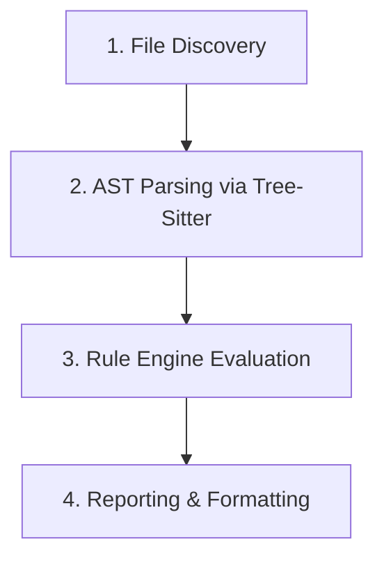

# Cypher CLI: What It Does & How It Works

Cypher CLI is a fast, production-grade Static Application Security Testing (SAST) and auditing tool built in Rust. It helps developers identify security vulnerabilities, secrets exposure, and insecure coding patterns directly within their codebases before deployment.

---

## 1. What Cypher CLI Does (Features & Capabilities)

Cypher CLI acts as an automated security auditor for your repository. Its core functionalities include:

### 🔍 Framework & Infrastructure Detection
When you initiate a scan, Cypher automatically identifies the technologies, libraries, and infrastructure configurations used in the project, such as:
- **Web Frameworks**: React, Express, Django, Flask, Rails, Laravel, etc.
- **Infrastructure as Code (IaC)**: Terraform, Kubernetes configuration files.
- **Containers**: Dockerfile configurations.

### 🛡️ Vulnerability Rule Coverage
Cypher contains 19+ built-in security rules targeting common security risks:
- **Hardcoded Secrets**: AWS access keys, private keys, database credentials/URLs, API keys, and bearer tokens.
- **Injection Flaws**: SQL injection via string concatenation/formatting, command injection, and shell injection.
- **Cross-Site Scripting (XSS)**: Insecure DOM manipulation via `innerHTML` or `document.write`.
- **Insecure Cryptography**: Deprecated hash algorithms (MD5, SHA-1) and non-cryptographic random number generators.
- **Other Risks**: Unsafe deserialization of untrusted data and exposure of sensitive credentials in log outputs.

### 📊 Multiple Output Formats
It can format and output scanning results in multiple ways:
- **Terminal Text**: Human-readable colorized CLI report with code snippets.
- **JSON**: Structured format ideal for scripting and automation.
- **SARIF (Static Analysis Results Interchange Format)**: Industry-standard JSON format for direct integration with GitHub Code Scanning, GitLab CI, and other DevSecOps platforms.
- **HTML**: Self-contained, visually clean HTML report summarizing findings.

---

## 2. How Cypher CLI Works (Under the Hood)

Cypher CLI executes a systematic four-phase static analysis pipeline:



### Phase 1: File Discovery & Filtering
1. **Directory Traversal**: Cypher uses a concurrent walker to recursively search directories.
2. **Concurrency**: Respects configuration parameters (e.g., `max_threads` in `cypher.toml`) to scan files in parallel.
3. **Exclusion Check**: Filters out ignored files, directories (like `node_modules`, `.git`, or `target`), and files exceeding the size limit.
4. **Language Matching**: Maps file extensions to their corresponding programming language to load relevant security rules.

### Phase 2: AST Parsing (Abstract Syntax Trees)
Unlike naive line-by-line regex search tools that generate high volumes of false positives, Cypher parses source code structurally:
- **Tree-Sitter Integration**: Cypher embeds concrete language grammars (`tree-sitter-rust`, `tree-sitter-javascript`, `tree-sitter-python`, `tree-sitter-go`).
- **AST Generation**: Source code is parsed into a tree of semantic syntax nodes (e.g., separating variables, functions, arguments, and strings).
- This structure allows the engine to recognize *exactly* where a string is constructed or if a command-line function receives unsanitized input.

### Phase 3: Rule Engine Execution
1. **Rule Selection**: The engine activates the specific subset of rules that apply to the detected file language.
2. **Evaluation**: Matches syntax structures and patterns against AST nodes. For rules utilizing regular expressions, it executes optimized regex matching against relevant nodes.
3. **Location Isolation**: It records the precise start byte, end byte, line number, column offset, and matching text line to provide rich context.

### Phase 4: Formatting & Output
- The `Reporter` trait takes the results of the rule matching.
- It extracts the line code context to build visual code snippets.
- Writes the formatted report (terminal stdout, HTML file, SARIF file, or JSON) based on user flags.

---

## 3. How to Configuration & Control

You can control Cypher CLI's behavior via a `cypher.toml` configuration file in your project root:

```toml
[general]
max_threads = 4  # Concurrency limit

[scanner]
exclude_paths = ["node_modules", "target", ".git"]
max_file_size = 10485760  # Ignore files larger than 10MB

[rules]
severity_threshold = "medium"  # low, medium, high, critical
```
