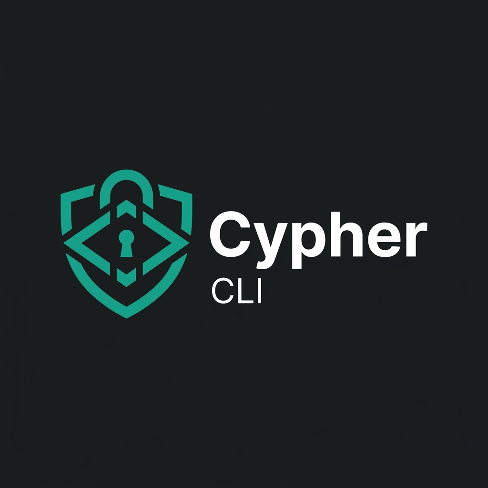
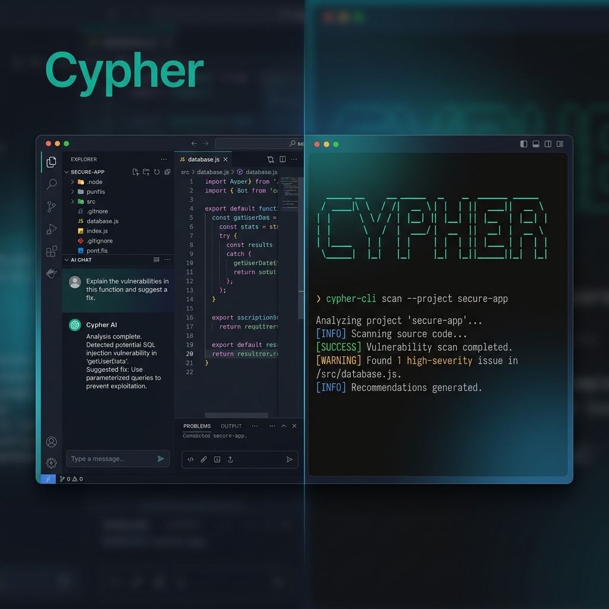

<p align="center">
  
</p>

<p align="center">A security-focused AI coding agent — built as a VS Code fork CLI/extension by Ayan-Flash.</p>

<p align="center">
  <a href="https://github.com/Ayan-Flash/Cypher"></a>
  <a href="https://www.npmjs.com/package/cypher-cli"></a>
</p>



---

Cypher CLI is a security-focused AI coding agent built as a VS Code fork CLI/extension by [Ayan-Flash](https://github.com/Ayan-Flash). It works in the terminal as a powerful CLI tool. Pick from 500+ models, switch between them mid-task, and pay the model provider's rate with zero markup.

### Installation

<details open>
<summary><strong>CLI (npm)</strong></summary>

<br>

```bash
# npm
npm install -g cypher-cli

# pnpm
pnpm add -g cypher-cli

# bun
bun add -g cypher-cli
```

Then run `cypher` in any project directory to start.

</details>

<details>
<summary>Install from GitHub Releases (binaries)</summary>

Download the latest binary from the [Releases page](https://github.com/Ayan-Flash/Cypher/releases).

| Platform | Asset |
|---|---|
| Windows (most PCs) | `cypher-windows-x64.zip` |
| macOS (Apple Silicon) | `cypher-darwin-arm64.zip` |
| macOS (Intel) | `cypher-darwin-x64.zip` |
| Linux x64 | `cypher-linux-x64.tar.gz` |
| Linux ARM | `cypher-linux-arm64.tar.gz` |

</details>

### Agents

Cypher ships with specialized agents you switch between depending on the task. You can also build your own custom agents.

- **Code** - The default. Implements and edits code from natural language.
- **Plan** - Designs architecture and writes implementation plans before any code gets written.
- **Ask** - Answers questions about your codebase without touching any files.
- **Debug** - Troubleshoots and traces issues.
- **Review** - Reviews your changes and surfaces issues across performance, security, style, and test coverage.

### What it does

- **Security-first code analysis** — every interaction is filtered through a security lens.
- **Code generation** from natural language, across multiple files.
- **Self-checking** so the agent reviews and corrects its own work.
- **Terminal control** to run commands and automate tasks.
- **500+ models** with mid-task switching, so you can match latency, cost, and reasoning to the job.

### Autonomous Mode (CI/CD)

Run `cypher run` with `--auto` for fully autonomous operation with no prompts, built for CI/CD pipelines:

```bash
cypher run --auto "run tests and fix any failures"
```

`--auto` disables all permission prompts and lets the agent execute any action without confirmation. Only use it in trusted environments.

### Contributing

Contributions are welcome. Start with the [Contributing Guide](/CONTRIBUTING.md) for environment setup, coding standards, and how to open a pull request.

Please review our [Code of Conduct](/CODE_OF_CONDUCT.md) before getting involved.

### License

MIT. You're free to use, modify, and distribute this code, including commercially, as long as you keep the attribution and license notices. See [License](/LICENSE).

### FAQ

<details>
<summary>Where did Cypher CLI come from?</summary>

Cypher CLI is a VS Code fork CLI/extension built by [Ayan-Flash](https://github.com/Ayan-Flash), based on [OpenCode](https://github.com/anomalyco/opencode), enhanced with a security-first focus.

</details>

<details>
<summary>What makes Cypher different from other AI coding tools?</summary>

Cypher is not a general-purpose coding assistant. It's a **Senior Security Engineer** — every response, tool call, and generated code is filtered through the question: *does this make the user's software more secure?*

</details>

---

**Built by [Ayan-Flash](https://github.com/Ayan-Flash)** | [GitHub](https://github.com/Ayan-Flash/Cypher)
