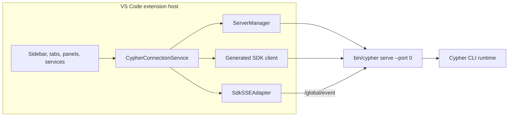

# VS Code Extension Architecture

The VS Code extension (`packages/cypher-vscode/`) is a client of [Cypher CLI runtime](/docs/contributing/architecture/cli-runtime). It bundles platform CLI binary, starts one shared editor-owned `cypher serve` server on demand, and drives that server through generated SDK HTTP calls plus global SSE.


This page covers extension-host ownership, webview routing, Agent Manager, local terminal paths, recovery, bundled resources, and build outputs. It is not full extension feature inventory.


## Shared server ownership

[CLI Runtime](/docs/contributing/architecture/cli-runtime) defines shared local-server authentication, directory routing, provider routing, persistence, and SSE contracts. This page starts at VS Code client boundary.

Activation creates one `CypherConnectionService`. It owns one `ServerManager`, one active SDK client, and one SSE adapter. `ServerManager` owns child process lifecycle. This editor-owned child is separate from detached local daemon managed by `cypher daemon`.



| Area | Behavior |
|---|---|
| Startup | Lazy on client demand; autocomplete prewarm can start server during activation |
| Binary | Uses extension `bin/cypher`, or `bin/cypher.exe` on Windows |
| Port | Starts `cypher serve --port 0`; CLI server prefers `4096`, then asks OS for free port |
| Authentication | Generates random 32-byte hex password per spawn and passes it as `CYPHER_SERVER_PASSWORD`; username defaults to `cypher` |
| Reuse | Sidebar, editor tabs, panels, Agent Manager, and host services share active server |
| Exit | `ServerManager` clears dead child; connection service clears SDK/SSE state and enters error state |
| Replacement | Later retry or connection attempt starts replacement server |

## Shared consumers

Shared service has more consumers than chat tabs:

| Family | Consumers |
|---|---|
| Chat | Sidebar provider and editor-tab providers |
| Panels | Settings, profile and marketplace surfaces, sub-agent viewers, Agent Manager, CypherClaw |
| Diff | Diff Viewer, Diff Virtual, and diff source catalog |
| Editor assistance | Autocomplete and commit-message generation |
| Integrations | Browser automation MCP registration and CypherClaw bootstrap |

New mutable state must account for concurrent consumers and multiple directory contexts on one process.

## Webview bridge

Main chat webviews use host-mediated message bridge:

```text
webview vscode.postMessage()
  -> CypherProvider host handler
  -> generated SDK HTTP request
  -> CLI runtime
  -> /global/event SSE
  -> SdkSSEAdapter
  -> CypherConnectionService subscribers
  -> CypherProvider directory/session filtering and stream coalescing
  -> webview postMessage()
```

Global SSE carries wrapped events for multiple directories. Connection service broadcasts incoming payload plus directory to subscribers. Providers resolve session scope, maintain message-to-session lookup where events omit direct session ID, filter for relevant views, and coalesce high-frequency stream updates before posting UI messages.

## Agent Manager

Agent Manager is extension feature, not separate product. It opens as editor tab and manages parallel sessions, optional worktrees, terminals, diffs, setup scripts, and extra editor windows.

| Aspect | Sidebar | Agent Manager |
|---|---|---|
| Primary use | One active chat view | Multi-session orchestration |
| Git isolation | Workspace root by default | Optional worktree per session |
| Backend | Shared `cypher serve` process | Same shared process |
| Request routing | Workspace directory | Session worktree path passed as SDK `directory` |
| CLI instance key | Normalized workspace root | Normalized worktree directory |

Agent Manager request path is:

```text
session worktree path -> SDK directory -> CLI directory-routing middleware -> InstanceStore directory key
```

Agent Manager persists state in `.cypher/agent-manager.json` and worktrees under `.cypher/worktrees/`. Startup migration moves Agent Manager-owned data from legacy `.cypher/` paths when target items do not already exist and repairs git worktree refs.

## State boundaries

Directory-keyed CLI state is isolated by worktree path. Process-owned state remains shared because all Agent Manager sessions use one CLI process. Snapshot implementation state is directory-keyed, but slow-snapshot prompt guard belongs to shared `Snapshot.Service` scope. Managed Agent Manager prompts pass `snapshotInitialization: "wait"` so slow baseline setup waits without interrupting concurrently started sessions.

## Terminal surfaces

VS Code extension has two terminal paths:

| Surface | Owner | Use |
|---|---|---|
| VS Code integrated terminal | VS Code host | Shell terminals and setup-script execution surfaced through editor |
| CLI PTY WebSocket tab | Agent Manager and `cypher serve` server | Server-created PTY session streamed over loopback WebSocket |

Agent Manager PTY WebSocket URL uses `auth_token=<base64 cypher:password>` query mode because browser WebSocket API cannot attach Basic header. Webview CSP permits loopback HTTP and WebSocket origins for active server port. CLI also exposes scope-bound short-lived PTY ticket API as alternate browser WebSocket auth mode.

## Config split

| Config owner | Examples |
|---|---|
| VS Code settings | `cypher-cli.new.*` extension UI, proxy, autocomplete, and integration settings |
| CLI config | Global and project `cypher.jsonc`, `cypher.json`, compatible OpenCode files, provider auth, tools, permissions, modes |

Extension-specific behavior belongs in VS Code settings. Agent runtime behavior belongs in CLI config so TUI, Console, VS Code, and JetBrains can share it.

## Bundled resources

| Resource | Behavior |
|---|---|
| CLI executable | Platform binary under extension `bin/`; Windows uses `cypher.exe` |
| CLI Tree-sitter WASM | Copied under `bin/tree-sitter`; backend spawn sets `CYPHER_TREE_SITTER_WASM_DIR` |
| FFmpeg helper | Bundled for supported targets for speech capture; capture code also checks system fallback paths |
| Empty-window cwd | Uses extension global storage directory when no VS Code workspace folder exists |
| Empty-window indexing | Sets `CYPHER_DISABLE_CODEBASE_INDEXING=vscode-no-workspace` so CLI reports indexing disabled |

Speech-to-text captures audio locally, then sends completed recording through shared editor-owned `cypher serve` server to authenticated Cypher Gateway transcription path. It is batch transcription, not direct provider streaming.

## Recovery

| Failure signal | Response |
|---|---|
| Missing SSE events for 15 seconds | SSE adapter aborts attempt and reconnects |
| SSE reconnect | Starts at 250 ms delay and backs off to 5 seconds until stream opens |
| Health poll | Every 10 seconds, checks `/global/health` with 3 second timeout; failure forces SSE reconnect |
| Server exit | Clears connection state, reports error, and lets later retry or connection attempt spawn replacement |
| Extension disposal | Stops polls, disposes SSE, and sends server process group termination with kill fallback |

## Builds

| Build | Source | Output |
|---|---|---|
| Extension host | `src/extension.ts` | `dist/extension.js` |
| Sidebar and editor chat webview | `webview-ui/src/index.tsx` | `dist/webview.js` |
| Agent Manager webview | `webview-ui/agent-manager/index.tsx` | `dist/agent-manager.js` |
| CypherClaw webview | `webview-ui/cypherclaw/index.tsx` | `dist/cypherclaw.js` |
| Diff Viewer webview | `webview-ui/diff-viewer/index.tsx` | `dist/diff-viewer.js` |
| Diff Virtual webview | `webview-ui/diff-virtual/index.tsx` | `dist/diff-virtual.js` |
| Shared Shiki worker | synthetic worker entry | `dist/shiki-worker.js` |

Extension host bundle targets Node/CommonJS. Browser webviews and shared worker use esbuild browser bundles. Run `bun run typecheck`, `bun run lint`, and targeted unit tests from `packages/cypher-vscode/` after changing this area.

## Source map

Paths below are relative to [`Cypher-Org/cypher`](https://github.com/Cypher-Org/cypher).

| Concern | Source path |
|---|---|
| Activation | `packages/cypher-vscode/src/extension.ts` |
| Editor-owned server child process | `packages/cypher-vscode/src/services/cli-backend/server-manager.ts` |
| Shared SDK and SSE ownership | `packages/cypher-vscode/src/services/cli-backend/connection-service.ts` |
| SSE reconnect adapter | `packages/cypher-vscode/src/services/cli-backend/sdk-sse-adapter.ts` |
| Agent Manager | `packages/cypher-vscode/src/agent-manager/` |
| Build entries | `packages/cypher-vscode/esbuild.js` |

## Related pages

- [Architecture Overview](/docs/contributing/architecture) - local and hosted execution map
- [CLI Runtime](/docs/contributing/architecture/cli-runtime) - shared local-server, routing, persistence, and SSE behavior
- [JetBrains Plugin](/docs/contributing/architecture/jetbrains-plugin) - corresponding editor-client architecture for JetBrains
- [Development Patterns](/docs/contributing/architecture/development-patterns) - choose code-ownership seam and validation workflow before editing extension contracts
